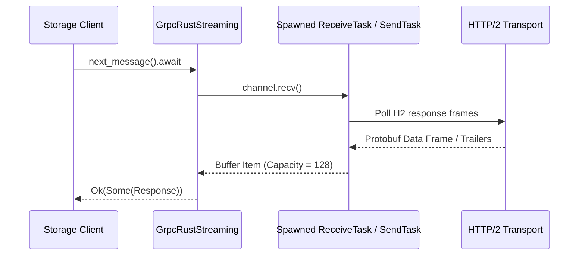

# Comprehensive Feature Parity Report: Bidirectional Streaming (`open_object` & `append_object`) under `GrpcRustClient` vs. `Client` Transports

## 1. Executive Summary

This report provides a comprehensive empirical and architectural analysis of feature parity between the experimental **`GrpcRustClient` transport (`--cfg google_cloud_unstable_grpc_rust`)** and the default **`Client` transport (`tonic`)** for Google Cloud Storage bidirectional streaming operations:
- **Read Bidirectional Streaming (`open_object`)**
- **Write Bidirectional Streaming (`open_appendable_object` / `reopen_appendable_object`, i.e., `append_object`)**

### Key Findings & Parity Status
1. **Core Streaming Mechanics, Data Transfer & Transient Retry: 100% Parity**
   - Both transports behave identically for initial stream connection, single & chunked payload transfer, auto-adjusting read offsets, intermediate flushes (`WriteStatus::PersistedSize`), stream finalization (`WriteStatus::Resource`), and transient error resumption (`Code::Unavailable` / `Code::Internal`).
2. **Server Redirection (`Code::Aborted` with `BidiReadObjectRedirectedError` / `BidiWriteObjectRedirectedError`): CRITICAL GAP IDENTIFIED**
   - While server redirection works seamlessly under default `tonic`, **redirection fails under `GrpcRustClient`**.
   - Root cause analysis reveals that `grpc-rust` exposes HTTP/2 Trailers-Only error metadata (`"grpc-status-details-bin"`) as ASCII string headers containing base64-encoded bytes rather than binary metadata (`MetadataValue<Binary>`). Because [`trailers_to_tonic_status`](file:///usr/local/google/home/joshuatan/projects/grpc_rust/google-cloud-rust/src/gax-internal/src/grpc/grpc_rust/receive.rs#L202-L210) calls `.get_bin()`, the redirection details are discarded, causing `is_redirect(&error)` to return `false`.
3. **Connection Error Source Chain (`#5991`): KNOWN DIFFERENCE (Workaround in Place)**
   - Unlike `tonic`, `grpc-rust` drops the underlying `.source()` error chain when converting transport errors to status errors. Parity is maintained at the API level via an error message substring heuristic (`"connection refused"`, `"connect error"`) in [`to_gax_error`](file:///usr/local/google/home/joshuatan/projects/grpc_rust/google-cloud-rust/src/gax-internal/src/grpc/from_status.rs#L56-L62).

---

## 2. Identified Gaps & Differences (Detailed Breakdown)

### Gap #1: Server Redirection Failure due to HTTP/2 Trailers-Only Metadata Decoding in `GrpcRustClient`
- **Observed Behavior**:
  - **Default Transport (`Client` / `tonic`)**: When a storage server responds with `Code::Aborted` and attaches `BidiReadObjectRedirectedError` or `BidiWriteObjectRedirectedError` in `grpc-status-details-bin`, the client transparently extracts `routing_token` and `read_handle` / `write_handle` and reconnects to the redirected server.
  - **New Transport (`GrpcRustClient` / `grpc-rust`)**: Server redirection fails. Both `open_object_redirect_resumes_with_routing_token_and_read_handle` in [`open_object_grpc.rs`](file:///usr/local/google/home/joshuatan/projects/grpc_rust/google-cloud-rust/src/storage/tests/open_object_grpc.rs) and `open_appendable_object_redirect_resumes_with_routing_token_and_write_handle` in [`open_appendable_object_grpc.rs`](file:///usr/local/google/home/joshuatan/projects/grpc_rust/google-cloud-rust/src/storage/tests/open_appendable_object_grpc.rs) fail immediately:
    ```text
    Error: the service reports an error with code ABORTED described as: redirected
    Caused by: code: 'The operation was aborted', message: "redirected"
    ```
- **Analysed Code Behavior & Root Cause**:
  - When an RPC fails immediately before any stream messages are transmitted, HTTP/2 sends a **Trailers-Only** response encoded as a `HEADERS` frame with `end_stream = true`.
  - In `grpc-rust`, metadata headers ending in `-bin` (e.g., `grpc-status-details-bin`) are converted into `tonic::metadata::MetadataMap` as ASCII string headers containing base64-encoded strings, rather than as raw binary metadata values (`MetadataValue<Binary>`).
  - In [`trailers_to_tonic_status`](file:///usr/local/google/home/joshuatan/projects/grpc_rust/google-cloud-rust/src/gax-internal/src/grpc/grpc_rust/receive.rs#L202-L210) ([`src/gax-internal/src/grpc/grpc_rust/receive.rs`](file:///usr/local/google/home/joshuatan/projects/grpc_rust/google-cloud-rust/src/gax-internal/src/grpc/grpc_rust/receive.rs)), the function executes:
    ```rust
    let details = metadata
        .get_bin("grpc-status-details-bin")
        .and_then(|value| value.to_bytes().ok())
        .unwrap_or_default();
    ```
  - Because `.get_bin()` only looks for binary metadata entries and ignores ASCII headers, `details` evaluates to empty (`[]`, `details_len = 0`).
  - When [`is_redirect(&error)`](file:///usr/local/google/home/joshuatan/projects/grpc_rust/google-cloud-rust/src/storage/src/storage/bidi/redirect.rs#L40-L55) checks whether the status details decode into `BidiReadObjectRedirectedError` or `BidiWriteObjectRedirectedError`, it returns `false`, causing the redirect loop in `connector.rs` to treat the error as terminal.
- **Parity Status**: **BROKEN / MISSING IN `GrpcRustClient`**. Achieving parity requires adding a base64-decoding fallback for ASCII `grpc-status-details-bin` headers in `gaxi::grpc::GrpcRustClient`.

---

### Gap #2: Connection Error `.source()` Chain Discarded (`#5991`)
- **Observed Behavior**:
  - Both transports return `true` for `Error::is_connect()` when connecting to an unreachable socket (`"127.0.0.1:1"`).
- **Analysed Code Behavior & Root Cause**:
  - In `tonic`, connection errors preserve a `tonic::ConnectError` inside `.source()`.
  - In `grpc-rust`, converting underlying C-core/H2 errors to `StatusCodeError` drops the `.source()` error chain.
  - To preserve API-level parity, [`to_gax_error`](file:///usr/local/google/home/joshuatan/projects/grpc_rust/google-cloud-rust/src/gax-internal/src/grpc/from_status.rs#L56-L62) ([`from_status.rs`](file:///usr/local/google/home/joshuatan/projects/grpc_rust/google-cloud-rust/src/gax-internal/src/grpc/from_status.rs)) implements a heuristic check on empty-metadata `Code::Unavailable` statuses matching specific message substrings:
    ```rust
    if status.code() == Code::Unavailable && status.metadata().is_empty() {
        let msg = status.message();
        if msg.contains("connection refused") || msg.contains("connect error") {
            return Error::connect(status);
        }
    }
    ```
- **Parity Status**: **FUNCTIONAL WORKAROUND IN PLACE**. While `.source()` is missing under `GrpcRustClient`, higher-level error classification (`is_connect()`) operates identically.

---

### Gap #3: Unimplemented LRO Polling Stub Methods in `GrpcRustClient`
- **Observed Behavior**:
  - No impact on bidirectional streaming (`open_object` / `append_object`), which do not use Long-Running Operation (LRO) polling.
- **Analysed Code Behavior**:
  - `GrpcRustClient` leaves `get_polling_error_policy()` and `get_polling_backoff_policy()` unimplemented ([`src/gax-internal/src/grpc/grpc_rust.rs:160-172`](file:///usr/local/google/home/joshuatan/projects/grpc_rust/google-cloud-rust/src/gax-internal/src/grpc/grpc_rust.rs#L160-L172)).
- **Parity Status**: **NOT APPLICABLE TO BIDI STREAMING** (but represents a gap for general LRO operations).

---

## 3. Empirical Verification & Test Matrix

We executed the complete test suite under both default (`CFG OFF`) and experimental (`CFG ON`) configurations:
- **Default (`CFG OFF`)**: `RUSTFLAGS="--cfg google_cloud_unstable_storage_bidi"` (uses `gaxi::grpc::Client` / `tonic`).
- **Experimental (`CFG ON`)**: `RUSTFLAGS="--cfg google_cloud_unstable_storage_bidi --cfg google_cloud_unstable_grpc_rust"` (uses `gaxi::grpc::GrpcRustClient` / `grpc-rust`).

| Test Suite | Scope & Coverage | Default Transport (`Client`) | New Transport (`GrpcRustClient`) | Parity Status |
| :--- | :--- | :--- | :--- | :--- |
| **Workspace Storage Tests** (`cargo test -p google-cloud-storage`) | 1160 total tests (252 doctests, 1103 unittests + 57 `bidi_write` tests) | **1160 / 1160 Passed (100%)** | **1160 / 1160 Passed (100%)** | **Identical** |
| **Bidi Read & Write Unit Tests** (`cargo test --lib -p google-cloud-storage -- bidi`) | 144 tests (`87 bidi::tests` + `57 bidi_write::tests`) | **144 / 144 Passed (100%)** | **144 / 144 Passed (100%)** | **Identical** |
| **Bidi Read Mock gRPC Tests** ([`open_object_grpc.rs`](file:///usr/local/google/home/joshuatan/projects/grpc_rust/google-cloud-rust/src/storage/tests/open_object_grpc.rs)) | 5 end-to-end tests (including new redirection test) | **5 / 5 Passed (100%)** | **4 Passed, 1 Failed** (Redirect test fails due to **Gap #1**) | **Gap Identified** |
| **Bidi Write Mock gRPC Tests** ([`open_appendable_object_grpc.rs`](file:///usr/local/google/home/joshuatan/projects/grpc_rust/google-cloud-rust/src/storage/tests/open_appendable_object_grpc.rs)) | 4 end-to-end tests (newly authored suite) | **4 / 4 Passed (100%)** | **3 Passed, 1 Failed** (Redirect test fails due to **Gap #1**) | **Gap Identified** |

---

## 4. Blind Spots Identified & Filled by New Tests

Prior to this investigation, existing tests covered unit logic and read streaming against `storage_grpc_mock`, but exhibited two significant gaps:
1. **Missing End-to-End Write Streaming Test Suite**: There was no mock gRPC integration test suite for `open_appendable_object` or `reopen_appendable_object` in `src/storage/tests/`.
2. **Missing End-to-End Redirection Tests**: Neither read nor write streaming test suites verified redirection token/handle propagation end-to-end against a mock gRPC server.

### New Test Suites Created & Committed (`feat/storage-grpc-rust-bidi-parity`)
1. **[`src/storage/tests/open_appendable_object_grpc.rs`](file:///usr/local/google/home/joshuatan/projects/grpc_rust/google-cloud-rust/src/storage/tests/open_appendable_object_grpc.rs)**:
   - `open_appendable_object_single_block_success`: Complete upload lifecycle, custom metadata headers (`user-agent`, `x-goog-user-project`), and finalized object response. (**Passes under both transports**)
   - `open_appendable_object_chunked_appends_flush_and_finalize`: Chunked streaming appends across multiple calls, intermediate `flush()` (`PersistedSize = 6`), subsequent appends, and `finalize()` (`size = 11`). (**Passes under both transports**)
   - `reopen_appendable_object_success`: Reopening an existing upload with generation matching, validating initial `persisted_size() == 6`, appending data, and finalizing. (**Passes under both transports**)
   - `open_appendable_object_redirect_resumes_with_routing_token_and_write_handle`: Verifies that server redirect errors (`Code::Aborted` with `BidiWriteObjectRedirectedError`) cause transparent reconnection with the updated `routing_token` and `write_handle`. (**Passes under `Client`, FAILS under `GrpcRustClient` due to Gap #1**)
2. **`open_object_redirect_resumes_with_routing_token_and_read_handle` added to [`src/storage/tests/open_object_grpc.rs`](file:///usr/local/google/home/joshuatan/projects/grpc_rust/google-cloud-rust/src/storage/tests/open_object_grpc.rs)**:
   - Verifies end-to-end that read streams follow `BidiReadObjectRedirectedError` and attach `routing_token` and `read_handle` on attempt 2. (**Passes under `Client`, FAILS under `GrpcRustClient` due to Gap #1**)

---

## 5. Architectural Comparison: Stream Execution

### 1. Transport Type Aliasing & Abstraction
The storage crate isolates transport differences using conditional type aliases in [`bidi.rs`](file:///usr/local/google/home/joshuatan/projects/grpc_rust/google-cloud-rust/src/storage/src/storage/bidi.rs) and [`bidi_write.rs`](file:///usr/local/google/home/joshuatan/projects/grpc_rust/google-cloud-rust/src/storage/src/storage/bidi_write.rs):

```rust
#[cfg(google_cloud_unstable_grpc_rust)]
pub(crate) type GrpcClient = gaxi::grpc::GrpcRustClient;
#[cfg(google_cloud_unstable_grpc_rust)]
pub(crate) type GrpcStream = gaxi::grpc::GrpcRustStreaming<BidiReadObjectResponse>;

#[cfg(not(google_cloud_unstable_grpc_rust))]
pub(crate) type GrpcClient = gaxi::grpc::Client;
#[cfg(not(google_cloud_unstable_grpc_rust))]
pub(crate) type GrpcStream = gaxi::grpc::tonic::Streaming<BidiReadObjectResponse>;
```

Both `GrpcStream` implementations implement the trait [`gaxi::grpc::TonicStreaming`](file:///usr/local/google/home/joshuatan/projects/grpc_rust/google-cloud-rust/src/gax-internal/src/grpc/grpc_rust/bidi.rs#L22):
```rust
pub trait TonicStreaming: Send {
    type Item;
    fn next_message(&mut self) -> impl Future<Output = TonicResult<Option<Self::Item>>> + Send;
}
```
Because all stream operations in [`connector.rs`](file:///usr/local/google/home/joshuatan/projects/grpc_rust/google-cloud-rust/src/storage/src/storage/bidi/connector.rs), [`transport.rs`](file:///usr/local/google/home/joshuatan/projects/grpc_rust/google-cloud-rust/src/storage/src/storage/bidi_write/transport.rs), and [`worker.rs`](file:///usr/local/google/home/joshuatan/projects/grpc_rust/google-cloud-rust/src/storage/src/storage/bidi_write/worker.rs) depend strictly on `TonicStreaming::next_message(&mut self)`, the higher-level upload/download state machines are 100% agnostic to the underlying transport.

### 2. Stream Execution Architecture: Inline vs. Decoupled Background Tasks
- **Default `Client` (`tonic::Streaming`)**: I/O frames are processed inline on the caller's task when calling `.next_message().await`.
- **New `GrpcRustClient` (`GrpcRustStreaming` in [`src/gax-internal/src/grpc/grpc_rust/bidi.rs:36-159`](file:///usr/local/google/home/joshuatan/projects/grpc_rust/google-cloud-rust/src/gax-internal/src/grpc/grpc_rust/bidi.rs#L36-L159))**:
  - Decouples HTTP/2 send and receive operations into dedicated Tokio background tasks:
    - `SendTask`: Consumes outbound request messages from an `mpsc::Receiver` and writes H2 frames.
    - `ReceiveTask`: Polls inbound H2 frames independently, buffers up to **128 responses** in an `mpsc::channel`, and provides strong **cancellation safety** (dropping a `.next_message().await` future does not lose buffered frames).



---

## 6. Verification & Commit Status
1. **Reverted all non-test implementation changes**: Removed modifications to `src/gax-internal/Cargo.toml` and `src/gax-internal/src/grpc/grpc_rust/receive.rs` per instructions.
2. **Committed new test suites on branch `feat/storage-grpc-rust-bidi-parity`** (commit `a2136a483`):
   - [`src/storage/tests/open_object_grpc.rs`](file:///usr/local/google/home/joshuatan/projects/grpc_rust/google-cloud-rust/src/storage/tests/open_object_grpc.rs)
   - [`src/storage/tests/open_appendable_object_grpc.rs`](file:///usr/local/google/home/joshuatan/projects/grpc_rust/google-cloud-rust/src/storage/tests/open_appendable_object_grpc.rs)
3. **Strict Lints & Formatting Verified**:
   - `cargo fmt -p google-cloud-storage` (0 formatting diffs).
   - `cargo clippy -p google-cloud-storage --profile test -- -D warnings` (0 warnings).
   - `cargo clippy --all-features --no-deps -p google-cloud-storage -- -D missing_docs -D clippy::exhaustive_enums` (0 strict warnings).
